# Gapsi — B2B Sales Intelligence Agent

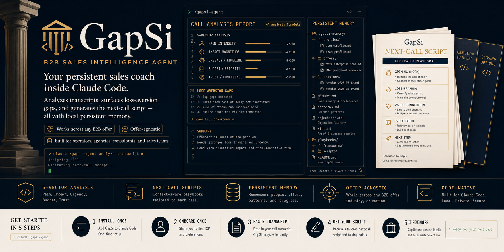

[](LICENSE)
[](https://claude.ai/code)
[](https://github.com/termsheetinator)

**A persistent B2B sales coach that lives inside Claude Code.** Paste a call transcript, get a forensic deal analysis — every gap named, the case rebuilt, a full script written in the prospect's own words. No transcript? Debrief it in two sentences and get the same output. It remembers every offer, every deal, every admission — across every session, entirely on your machine.

```bash
curl -fsSL https://raw.githubusercontent.com/termsheetinator/gapsi-agent/main/install.sh | bash
```

One install. One 3-minute onboarding. Then it coaches you for as long as you sell.

---

## Table of Contents

- [What This Is](#what-this-is)
- [The Problem It Solves](#the-problem-it-solves)
- [The Science It Runs On](#the-science-it-runs-on)
- [The Framework — 5 Steps](#the-framework--5-steps)
- [The Full System — Mind Map](#the-full-system--mind-map)
- [What It Covers](#what-it-covers)
- [How It Works](#how-it-works)
- [The 8 Modes](#the-8-modes)
- [How a Deal Moves Through Gapsi](#how-a-deal-moves-through-gapsi)
- [Old Economy / New Economy — Buyer Calibration](#old-economy--new-economy--buyer-calibration)
- [Enterprise Cycle Support](#enterprise-cycle-support)
- [MEDDPICC — When Decision Maker Gaps Become the Case](#meddpicc--when-decision-maker-gaps-become-the-case)
- [Five-Frame Inaction Cost Rotation](#five-frame-inaction-cost-rotation)
- [Scenarios — When You'd Reach For It](#scenarios--when-youd-reach-for-it)
- [Worked Example — One Deal, Start to Close](#worked-example--one-deal-start-to-close)
- [Output Format](#output-format)
- [The Results You Get](#the-results-you-get)
- [Benefits — and the Benefits of the Benefits](#benefits--and-the-benefits-of-the-benefits)
- [Fitting It Into Your Daily Workflow](#fitting-it-into-your-daily-workflow)
- [How It Remembers](#how-it-remembers)
- [How It Coaches](#how-it-coaches)
- [Who It's For](#whos-its-for)
- [Tips for Users](#tips-for-users)
- [Install](#install)
- [Update](#update)
- [Files](#files)
- [Requirements](#requirements)

---

## What This Is

Gapsi is a Claude Code skill that turns Claude into a specialized B2B sales coach built on the **Loss Aversion Gap Framework** — a closing methodology grounded in six peer-reviewed behavioral economics studies. Paste a real call transcript and it produces a forensic analysis: every gap named after the actual business problem, every missed question written for this specific prospect, and a complete next-call script built from their words, their math, and their stated goals. No transcript? Debrief a call in two sentences and get the same output. It tracks every prospect in a per-deal file with a full MEDDPICC decision-maker map, an admissions log, a scope feedback log, and a close-readiness checklist. It remembers your offers, your sales process, and your patterns across every session. Every full analysis ends with an offer to export it as a formatted Word document.

It is not a generic AI assistant with a sales prompt. It is a closed-loop sales system: **analyze → diagnose → script → call → analyze again** — with deal memory connecting every loop.

---

## The Problem It Solves

Most B2B deals don't die because the offer was wrong or the price was too high. They die because the case was never built:

- The rep never anchored the prospect's **goal** — so there was no reference point
- The current state was never **quantified** — so the pain stayed vague
- The rep stated the gap instead of letting the **prospect calculate it** — so it was never owned
- The cost of **doing nothing** was never made visible — so "let me think about it" felt safe
- Price showed up **before** the gap was expensive — so the fee floated alone, with nothing to compare against

Every one of those is detectable in a transcript. Every one of those is fixable on the next call. That's the entire job of this tool: find which step of the case collapsed, and hand you the exact language to rebuild it.

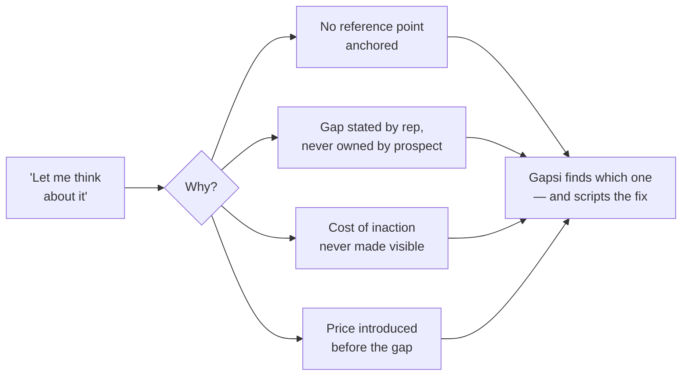

---

## The Science It Runs On

Gapsi's methodology isn't sales folklore. Every move is grounded in published, peer-reviewed research — with the actual numbers embedded in the coaching:

| Study | Finding | How Gapsi Uses It |
|---|---|---|
| **Kahneman & Tversky, 1979** — Prospect Theory | Losses feel **~2x** as painful as equivalent gains feel good | The entire framework: frame the engagement as stopping a loss, not buying an upside |
| **Tversky & Kahneman, 1981** — Framing Effects | Same decision, loss-framed vs. gain-framed: majority choice **reverses** (72% → 78% flip) | Loss framing doesn't nudge decisions — it reverses them. Gapsi checks every call for it |
| **Samuelson & Zeckhauser** — Status Quo Bias | Familiar pain beats unfamiliar improvement, even when the math favors change | Why "do nothing" is your real competitor — and how to make it expensive |
| **Kahneman, Knetsch & Thaler, 1990** — Endowment Effect | People value what they own at **~2.5x** its market worth | The prospect's current system carries inflated value in their mind. Surface what they've accepted as "normal" |
| **Heath, Larrick & Wu, 1999** — Goals as Reference Points | Falling short of a stated goal triggers **loss-aversion responses** — same machinery as losing money | Get the goal stated out loud, and the gap becomes an active, ongoing loss |
| **Novemsky & Kahneman, 2005** — Boundaries of Loss Aversion | Spending doesn't feel like a loss when the value exchange is clear | Price resistance is a gap problem, not a pricing problem |

The asymmetry the whole system is built on:

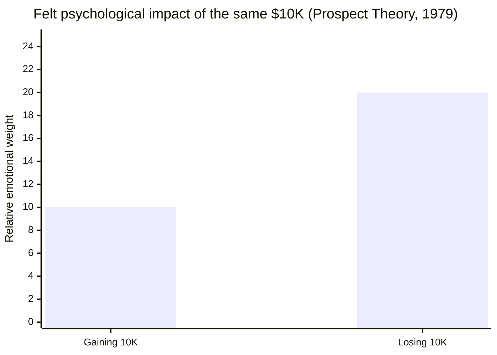

A confirmed $200K gap doesn't feel equal to a $50K fee — it feels roughly **4x heavier**. The fee is never the question. The gap is.

---

## The Framework — 5 Steps

> **People do not buy because the future is better. They buy when staying the same is more expensive than changing.**

Five steps. Each one has a dedicated specialist agent inside Gapsi that knows its science, its questions, its diagnostic flags, and its fixes. Every call is scored against all five. When an objection surfaces, it tells you which step is incomplete — and the answer is always a question back, never a rebuttal.

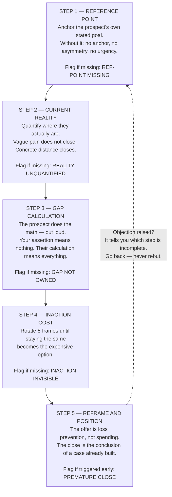

**The best closers are lawyers, not hype men.** They build a case so airtight the decision becomes obvious. Gapsi audits every call against these five steps, names every gap after the actual business problem, and hands you the exact script to rebuild the case on the next call.

---

## The Full System — Mind Map

Everything below ships in one skill file. No add-ons, no separate installs:

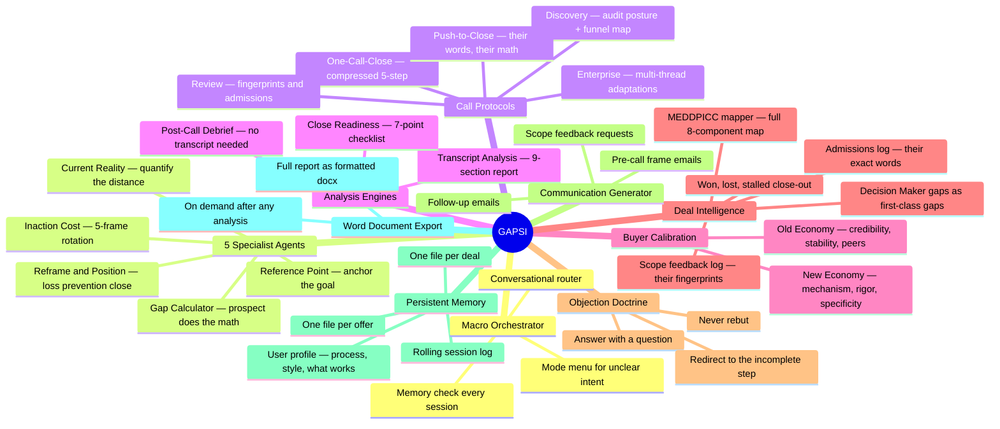

---

## What It Covers

```
━━━━━━━━━━━━━━━━━━━━━━━━━━━━━━━━━━━━━━━━━━━━━━━━━━━━━━━━━━━━━━
TRANSCRIPT ANALYSIS          9-section forensic report per call
━━━━━━━━━━━━━━━━━━━━━━━━━━━━━━━━━━━━━━━━━━━━━━━━━━━━━━━━━━━━━━
Core Principle               What this rep is actually selling — the real thesis
What Rep Missed              A verdict, not a checklist
Gaps Failed to Create        5–8 named business gaps — exact missed questions + solution fit
Gaps to Build on Next Call   Same gaps as prep material — 5 fields each
Admissions Captured          Their exact words acknowledging the cost of staying the same
The Next Call Script         Full script — exact language, intent in italics
What to Avoid                Prospect-specific behaviors that will hurt this deal
The One Sentence to Remember The close question — specific to this deal, not transferable
Decision Maker Status        Full MEDDPICC map with blind spots called out
━━━━━━━━━━━━━━━━━━━━━━━━━━━━━━━━━━━━━━━━━━━━━━━━━━━━━━━━━━━━━━
SCRIPT GENERATION            Adapts to call type, process type, and buyer type
━━━━━━━━━━━━━━━━━━━━━━━━━━━━━━━━━━━━━━━━━━━━━━━━━━━━━━━━━━━━━━
Discovery calls               Audit posture + funnel map + fingerprint ask
One-call-close                Compressed 5-step + hesitation handlers
Review calls                  Gap deepening, admissions, scope feedback collection
Closing calls                 Push-to-close built from their own math
Enterprise cycles             Multi-thread, multi-stakeholder adaptations
━━━━━━━━━━━━━━━━━━━━━━━━━━━━━━━━━━━━━━━━━━━━━━━━━━━━━━━━━━━━━━
DEAL INTELLIGENCE            Per-prospect tracking
━━━━━━━━━━━━━━━━━━━━━━━━━━━━━━━━━━━━━━━━━━━━━━━━━━━━━━━━━━━━━━
MEDDPICC mapping              Full 8-component decision-maker map per deal
Decision Maker gaps           Economic Buyer + Champion get full gap treatment if unknown
Admissions log                Their exact words, captured and used in closing scripts
Close readiness               7-point checklist before any push to close
Objection doctrine            Every objection answered with a question, never a rebuttal
━━━━━━━━━━━━━━━━━━━━━━━━━━━━━━━━━━━━━━━━━━━━━━━━━━━━━━━━━━━━━━
PERSISTENT MEMORY            Remembers across every session
━━━━━━━━━━━━━━━━━━━━━━━━━━━━━━━━━━━━━━━━━━━━━━━━━━━━━━━━━━━━━━
Multiple offers               One file per offer — price, deliverables, ICP
Deal files                    One file per prospect — gaps, admissions, stage
Objection library             Builds from real calls over time
Confirmed angles              Tracks which loss-aversion frames close your buyers
Session log                   Rolling history of last 5 sessions
━━━━━━━━━━━━━━━━━━━━━━━━━━━━━━━━━━━━━━━━━━━━━━━━━━━━━━━━━━━━━━
WORD DOCUMENT EXPORT         After every full analysis
━━━━━━━━━━━━━━━━━━━━━━━━━━━━━━━━━━━━━━━━━━━━━━━━━━━━━━━━━━━━━━
Full formatted .docx          Every report available as a print-ready Word document
                              One line at the end of every analysis — say yes and it builds
━━━━━━━━━━━━━━━━━━━━━━━━━━━━━━━━━━━━━━━━━━━━━━━━━━━━━━━━━━━━━━
```

---

## How It Works

1. **Install once** — run the curl command in your project directory
2. **Onboard once** — `/gapsi-agent` walks you through your offers and sales process (3 min)
3. **Work your deals** — paste transcripts, debrief calls, ask for scripts, handle objections
4. **It routes you** — a macro orchestrator reads what you need and drops you into the right mode
5. **It remembers** — every gap, admission, and decision-maker detail persists in `memory/`

Every message you send hits the orchestrator first. You never pick a mode. You just talk:

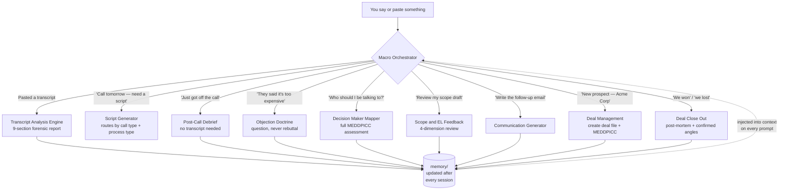

The routing is the product. You describe what you need — Gapsi identifies the session type, loads the deal, and executes.

---

## The 8 Modes

| # | Mode | What you get |
|---|---|---|
| 1 | **Analyze a call transcript** | Full 9-section CALL ANALYSIS REPORT — gaps named after the real business problem, full next-call script, Word doc on request |
| 2 | **Prep for an upcoming call** | Stage-by-stage script with exact language and intent behind every question — built from your deal history |
| 3 | **Work a deal** | Per-prospect tracking — stage, gaps, admissions, MEDDPICC, scope feedback log, materials sent |
| 4 | **Debrief a call (no transcript)** | Same intelligence extraction from your account — step assessment, admissions captured, memory updated |
| 5 | **Map decision makers** | MEDDPICC map with blind spots flagged and the priority component to uncover next |
| 6 | **Get feedback on a scope/proposal** | 4-dimension review: gap alignment, language, outcome clarity, fingerprint readiness |
| 7 | **Draft an email** | Follow-up, pre-call frame, or scope-feedback request — built from the deal's actual gaps and admissions |
| 8 | **Add or update an offer** | Offer file with price, deliverables, ICP, objection library, confirmed loss-aversion angles |

---

## How a Deal Moves Through Gapsi

Gapsi supports four sales process types — one-call-close, two-call-close, process-selling, and enterprise-cycle — and adapts every protocol to yours. Here's the full process-selling arc:

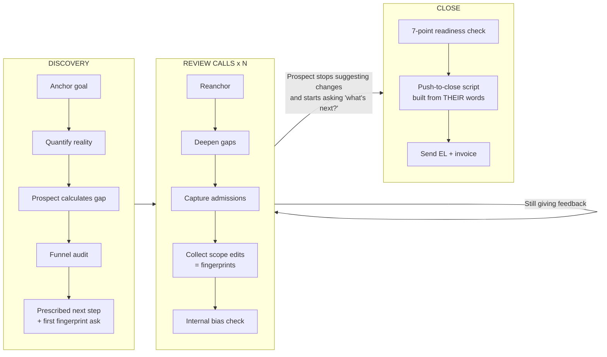

Two doctrines govern the whole arc:

**The Fingerprint Principle** — every edit the prospect suggests, every concern they raise, every section they comment on is them putting their hands on the deal. People advocate for what they helped build. The scope with their fingerprints on it is the scope they can defend internally.

**The Objection Doctrine** — never rebut. Every objection is diagnostic data telling you which of the 5 steps is incomplete:

| What they say | What it actually means | Gapsi's move |
|---|---|---|
| "It's too expensive" | Fear of execution, not affordability | "Compared to what — the current cost of the gap?" |
| "We need to think about it" | Something in the case isn't owned yet | "What part of what we've covered is still unclear?" |
| "We tried something like this before" | Past failure anxiety | "What happened relative to what you expected?" |
| "Send me some information" | Not ready to engage — testing your posture | "What specifically would help you decide this conversation is worth continuing?" |
| "Now's not the right time" | Inaction cost not real enough | "What would need to change?" |
| "We're looking at other options" | Internal uncertainty | "What are those options solving that this doesn't?" |
| Silence after interest | Approval confusion or bureaucracy | Don't chase. One value-add, then one micro-step CTA |

---

## Old Economy / New Economy — Buyer Calibration

Every protocol in Gapsi adapts to the buyer type before it generates a single question. This is not a style preference — it's a deal-critical calibration that runs at the start of every discovery call, carries through every review call, and resets whenever a new stakeholder joins the room.

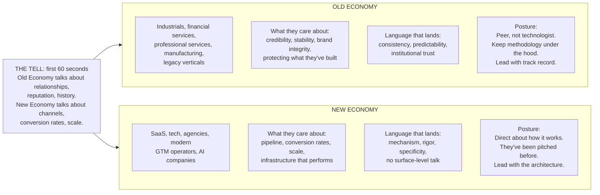

**Why it matters:** the same gap, framed in the wrong register, creates resistance instead of urgency. An Old Economy buyer who gets GTM infrastructure talk is confused. A New Economy buyer who gets a relationship-first pitch loses interest in 90 seconds. Every script Gapsi generates uses the register you established in discovery — and flags when a new stakeholder requires recalibration.

---

## Enterprise Cycle Support

When your process type is `enterprise-cycle`, Gapsi layers four critical adaptations onto every protocol:

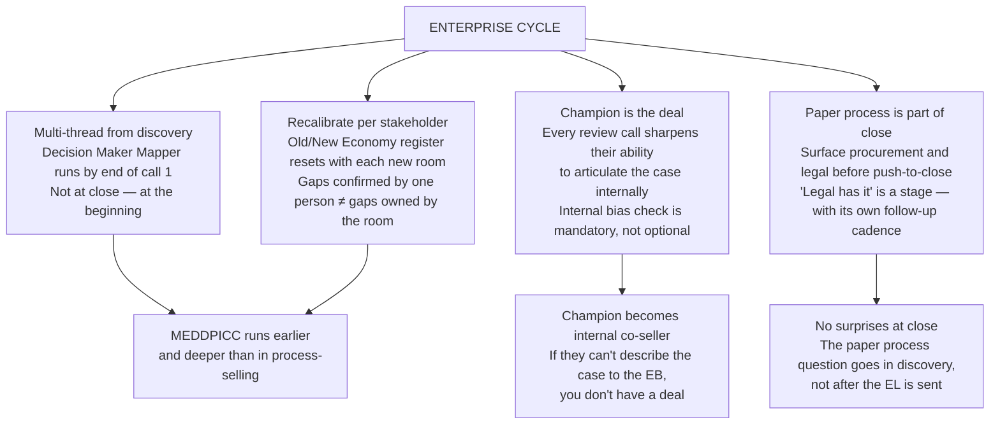

In enterprise cycles, the Champion is not a warm contact — they are the deal. A champion who can't articulate the internal case is a champion who can't close it. Every review call is a rehearsal for the conversation they'll have with the Economic Buyer when you're not in the room.

---

## MEDDPICC — When Decision Maker Gaps Become the Case

The MEDDPICC framework is how Gapsi tracks whether a deal actually has a buyer — not just a contact. After every transcript, Gapsi assesses all eight components:

| Component | What It Means | Status |
|---|---|---|
| **M** Metrics | Quantified success criteria | ✓ confirmed / ~ partial / ? unknown |
| **E** Economic Buyer | Who writes the check | ✓ confirmed / ~ partial / ? unknown |
| **D** Decision Criteria | How they evaluate options | ✓ confirmed / ~ partial / ? unknown |
| **D** Decision Process | Steps to a signed agreement | ✓ confirmed / ~ partial / ? unknown |
| **P** Paper Process | Legal and procurement path | ✓ confirmed / ~ partial / ? unknown |
| **I** Identified Pain | The quantified gap | ✓ confirmed / ~ partial / ? unknown |
| **C** Champion | Internal advocate | ✓ confirmed / ~ partial / ? unknown |
| **C** Competition | Other options in play | ✓ confirmed / ~ partial / ? unknown |

**The critical rule:** if your only contact is a champion with no path to the economic buyer, you do not have a deal — you have an internal sales rep. If you have an economic buyer but no champion, the case never gets built inside the org.

When either is missing after a call, Gapsi doesn't tuck a note into the MEDDPICC status block. It adds them as full, named gaps in the main analysis — same structure as every other business gap:

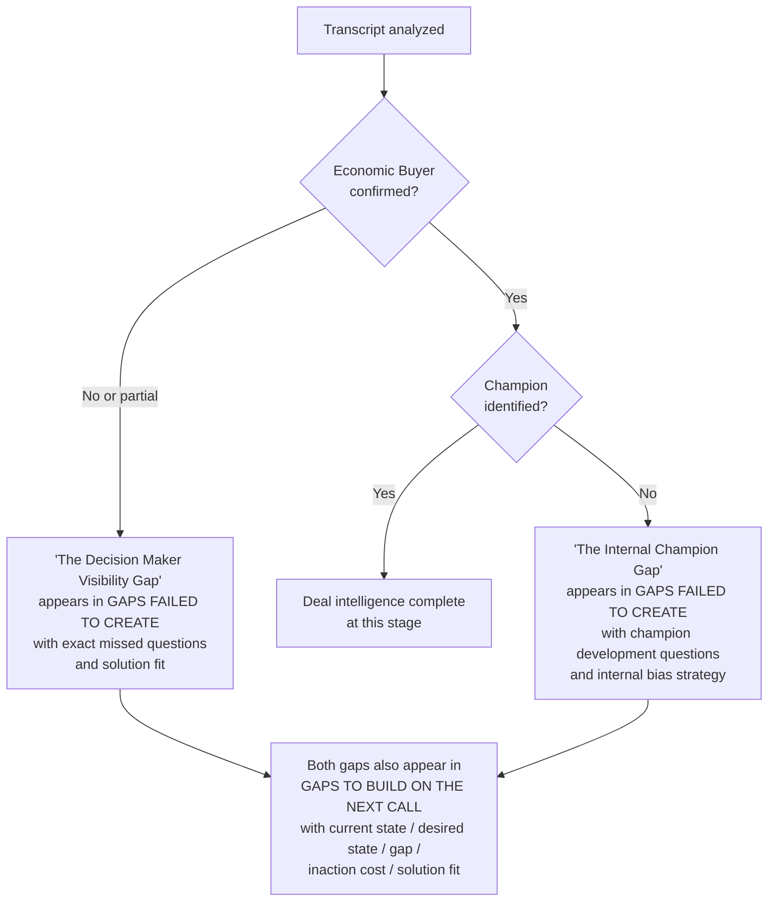

These are not administrative gaps. A deal that closes without a confirmed economic buyer path is a surprise. A deal that reaches close without a champion who can articulate the case internally is a deal that dies in the approval meeting.

---

## Five-Frame Inaction Cost Rotation

Step 4 of the framework — making staying the same more expensive than changing — is not a single question. It is a five-frame rotation deployed until you find the one that creates the most tension for this specific prospect.

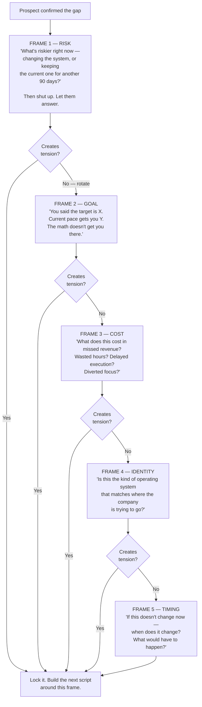

Gapsi tracks which frames were deployed on each call and which ones weren't. If inaction cost was invisible — the `INACTION INVISIBLE` flag — the analysis specifies exactly which frames were missed, and the next-call script deploys the most relevant one for this prospect's identity, risk profile, and stated goals.

---

## Scenarios — When You'd Reach For It

**The morning before a discovery call.** You type "discovery call with Meridian Logistics tomorrow, COO, came in through a referral." Gapsi builds a full audit-posture script: goal-anchoring questions, funnel audit sequence, decision-process probes, and a prescriptive close with a fingerprint ask — calibrated to whether you're selling into Old Economy (credibility, stability, peer posture) or New Economy (mechanism, rigor, specificity). You go in knowing exactly what you're extracting and what the next step looks like before the call starts.

**Ten minutes after a call ends.** You paste the transcript — nothing else. Gapsi already knows which deal it is, runs all five specialist agents against it, and hands you the full 9-section report: Core Principle, verdict, named business gaps (not framework labels), the full next-call script in your prospect's vocabulary, what to avoid, and the one sentence that determines the outcome of the next call. Then it offers to export the whole thing as a Word document.

**No transcript? Same output.** "Just got off with Acme — they liked the scope but the CFO wasn't on the call." Gapsi debriefs you, captures the admission, flags that your Economic Buyer is still unconfirmed at review call stage, adds "The Decision Maker Visibility Gap" to the deal file, and gives you the soft probe to use next call.

**Mid-deal, mid-panic.** "They just emailed saying the price feels high. What do I say?" Gapsi pulls the deal file — they confirmed a $200K gap in review call 2 — and gives you the one question that routes them back to their own math. Not a rebuttal. Not a defense. A question.

**The push.** "Is Northwind ready to close?" Gapsi runs the 7-point readiness checklist: gap owned, admissions captured (N total), fingerprints on scope, champion can articulate the internal case, economic buyer path confirmed. Either it generates the push-to-close script or tells you the single thing still missing.

**Enterprise, multi-stakeholder.** "The CFO is joining the review call next week." Gapsi recalibrates — Old or New Economy register for the CFO specifically, which MEDDPICC components are still unconfirmed for them, and how to re-establish the reference point with a new stakeholder without undoing what the champion already owns.

---

## Worked Example — One Deal, Start to Close

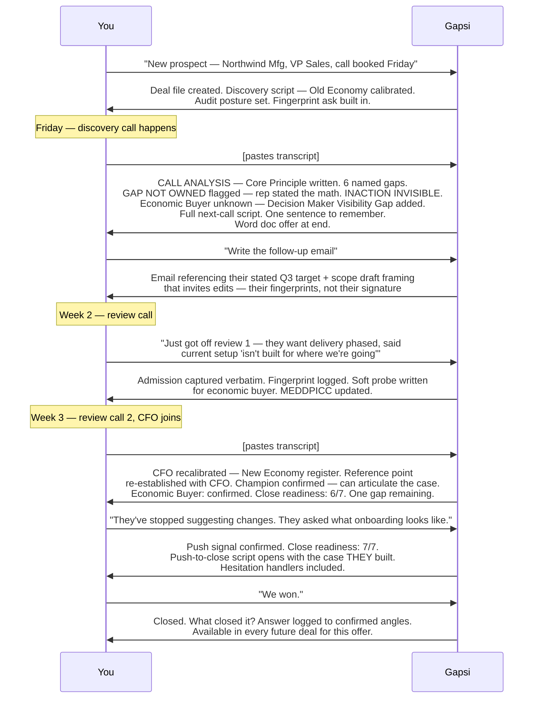

Every step of that exchange used memory from the steps before it. By the close, the script wasn't generic — it was built from that prospect's stated goal, their math, their admissions, and their fingerprints.

---

## Output Format

### Transcript Analysis Report

The full report outputs immediately on transcript paste — no menu, no selection. Every gap is named after the actual business problem. "The Referral Dependence Gap" tells you something. "Reference Point — Weak" tells you nothing about this deal.

```
## CALL ANALYSIS — ACME INDUSTRIAL | Discovery | June 3

---

### THE CORE PRINCIPLE

Acme isn't hiring you to build an outbound program. They're hiring you to stop
the slow attrition of market position that happens while competitors pick up the
accounts they're not reaching. The rep's job isn't to sell the system — it's to
make the cost of the current situation undeniable before any solution is discussed.

---

### WHAT THE REP MISSED

The call opened with social rapport that ran 12 minutes — almost a third of
available time. No reference point was anchored. The prospect said "we need to
grow outbound" but no specific number was extracted or confirmed. The gap was
then stated by the rep — the prospect never calculated or owned it. Price was
introduced before any of that math existed.

**Overall verdict:** Built rapport, never built the case

**Flags:** REF-POINT MISSING · GAP NOT OWNED · INACTION INVISIBLE · PREMATURE CLOSE

---

### GAPS THE REP FAILED TO CREATE

**Gap 1: The Pipeline Floor Nobody Named**

What happened: The prospect said "we need more qualified meetings" but was
never asked to name a number. No target was established. No anchor = no gap.

Questions that should have been asked:
- "Where are you trying to be by end of Q3 — what's the meeting volume?"
- "What number are you personally responsible for hitting?"
- "If we talked again in 90 days and things went perfectly — what would be
  true that isn't true today?"

The gap: They're generating 14 qualified meetings per month against a target
they've never been made to state — which means the gap is invisible to both parties.

How [Offer] fits: [The specific mechanism by which this offer closes this gap]

---

[Gap 2 through 6 follow same structure — most critical first]

---

### GAPS TO BUILD ON THE NEXT CALL

**Gap 1: The Pipeline Floor Nobody Named**
- **Current state:** 14 qualified meetings/month, 2 SDRs, no consistent channel
- **Desired state:** Not yet confirmed — making them state this number is the
  first move on the next call
- **Gap:** Unknown until they own the target — that's the opening frame
- **Inaction cost:** Every month without a confirmed target is a month the gap
  compounds without accountability — Q4 arrives with the same shortfall
- **Solution fit:** [Specific mechanism]

---

### ADMISSIONS CAPTURED

- "We've known outbound was broken since Q4." — came up unprompted when asked
  about current efforts; most useful admission on the call
- "We've tried to fix it internally and it hasn't worked." — said without probing

---

### THE NEXT CALL SCRIPT

**Opening Reframe**
*Do not open with the scope. Open with the business case.*
"Before we get into anything else — I left last call without one specific
number from you, and I need it before anything else makes sense. Where are
you trying to be by end of Q3? Give me the meeting volume target."

**Goal Confirmation**
*Make them own the number out loud.*
"When you say [what they say] — is that the number you're personally
accountable for, or is that aspirational?"

**Current Reality Confirmation**
*Use their numbers from the last call. They confirm, not re-explain.*
"So just to make sure I have this right: 14 qualified meetings a month,
2 SDRs, no outbound channel that's working consistently. Is that accurate?"

**Gap Statement**
*State the math. End with a confirmation.*
"So if the target is [X] and you're at 14 — that's a [X minus 14]-meeting
gap, every month. Does that track?"

**Inaction Question**
*Frame 3 — Cost — most relevant to where they are.*
"What does that gap cost in pipeline terms when it compounds into Q4?"

**Offer Reframe**
*Loss prevention, not spend.*
"Based on everything you've described, the question isn't whether this costs
something. The question is whether the current situation is more expensive
than solving it."

**Price Reframe** *(deploy only if price comes up)*
"When you say the number feels high — compared to what, exactly?"

**Internal Champion Close**
*Get them to rehearse the internal case.*
"If you were to bring this forward internally — how would you describe the
problem we just built the case around?"

**The Decision Question**
"You've described a [X]-meeting monthly shortfall that's been true since Q4
and that you've tried to fix internally without it moving. Is the current
situation expensive enough to solve now — or does it need to get worse first?"

---

### WHAT TO AVOID ON THIS CALL

- Do not ask another open-ended question about their growth goals — you've had
  two now and both stayed vague. Push for the specific number directly.
- Do not touch the scope or deliverables before the gap is owned — introducing
  solution detail before the problem is confirmed resets the conversation.
- Do not defend the price if it comes up — anchor it to the gap cost they'll
  confirm in the first 10 minutes.

---

### THE ONE SENTENCE TO REMEMBER

"If the target is 40 qualified meetings a month and you're at 14, you're
running 26 meetings short every month — what does that shortfall cost you
when it compounds into Q4?"

---

### DECISION MAKER STATUS (MEDDPICC)

Metrics:           ~ · "grow outbound" stated — number never confirmed
Economic Buyer:    ? · Only contact is VP Sales — who signs on this size?
Decision Criteria: ? · Not surfaced
Decision Process:  ? · Not surfaced
Paper Process:     ? · Not surfaced
Identified Pain:   ~ · Pain acknowledged — cost not quantified
Champion:          ? · Not identified
Competition:       ? · Not surfaced

Blind spots: Economic buyer and champion both unknown at discovery stage.
The soft process question is mandatory before review call 1.

---

*Want this as a formatted Word document? Say yes and I'll build it.*
```

### When you ask for a script

Stage-by-stage, exact language in quotes, intent behind every question in *italics*:

```
## REVIEW CALL SCRIPT — ACME INDUSTRIAL · Review Call 2

---

### OPENING — REANCHOR

"Last time, you said the target was 40 qualified meetings a month and you're at 14.
Before we go further — has anything changed?"
*Reanchors their reference point without starting over*

### PHASE 1 — DEEPEN EXISTING GAPS

"We didn't fully dig into what that 26-meeting shortfall costs in pipeline terms.
What does one month of that gap look like downstream — what doesn't close because
of it?"
*Their math, their words — not yours*

[Phases continue through scope feedback, internal bias check, and prescribed close]
```

---

## The Results You Get

**After every call:**
- A named analysis of every business gap — not framework labels, but the actual problem in this prospect's world. "The Referral Dependence Gap." "The Invisible Pipeline Floor." Names specific enough that you couldn't confuse this analysis with any other deal.
- A full next-call script — opening reframe, goal confirmation, gap statement, inaction question, offer reframe, price reframe if needed, internal champion close, and the decision question — all in exact language, all built from this call's transcript
- **One** priority fix. Never a list of twelve. The single change with the most leverage
- A Word document export on demand — the entire analysis formatted and print-ready

**Across every deal:**
- A MEDDPICC map that tells you who actually signs, who champions, and which blind spot to close next — with Decision Maker and Champion gaps surfaced as first-class analysis items when missing
- An admissions log — the prospect's own words acknowledging the cost of staying the same — that becomes the raw material of the closing script
- A close-readiness verdict before you push, so you never send an engagement letter into a case that isn't built

**Over months:**
- An objection library that grows from *your* real calls, mapped to responses that worked
- A confirmed-angles file per offer — which loss-aversion frames actually close *your* buyers
- A coach that knows your habits: the step you chronically skip, the moment you tend to pitch too early

---

## Benefits — and the Benefits of the Benefits

First-order benefits are what the tool does. Second-order benefits are what that does to your pipeline. Compounding benefits are what that does to your business:

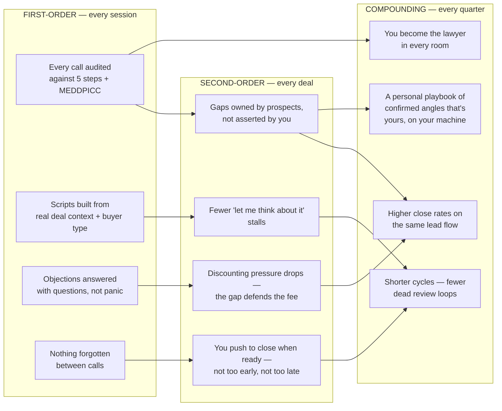

The deepest benefit isn't any single script. It's that the methodology gets **installed in you**. After thirty analyzed calls, you start hearing the missing reference point in real time, mid-conversation — before Gapsi ever sees the transcript.

---

## Fitting It Into Your Daily Workflow

Gapsi is built around the rhythm of a selling week, not a chat window:

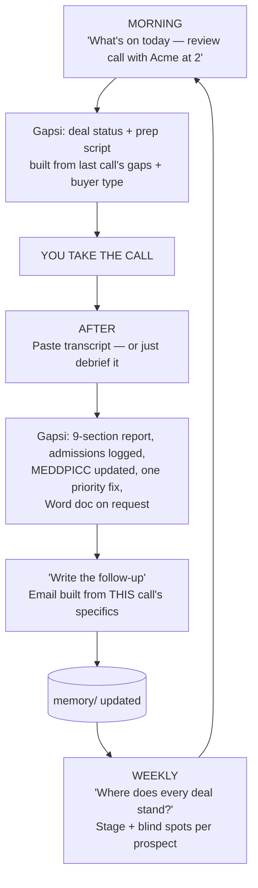

Typical touchpoints:

| Moment | What you do | Time |
|---|---|---|
| Before any call | "Prep me for [prospect]" | 2 min read |
| After any call | Paste transcript or debrief | 3 min |
| Stuck on a reply | "They said X — what do I say?" | 30 sec |
| Before sending a scope | "Review this draft" | 2 min |
| Before pushing to close | "Is [prospect] ready?" | 1 min |
| Deal ends | "We won/lost — here's why" | 1 min, compounds forever |

No dashboards to maintain, no CRM fields to fill. The memory updates itself as a side effect of you working your deals.

---

## How It Remembers

Gapsi stores everything in a `memory/` folder in your project directory — plain markdown files you can read, edit, or delete. No external database, no API keys, no cloud sync. Everything lives on your machine.

```
memory/
├── MEMORY.md              ← index of everything in memory
├── user-profile.md        ← your sales process, style notes, what works
├── offer-[slug].md        ← one file per offer you sell
├── session-log.md         ← rolling log of last 5 sessions
└── deals/
    └── deal-[slug].md     ← one file per prospect — MEDDPICC, gaps, admissions
```

A hook reads these files on every prompt and injects them into Claude's context automatically — your profile, offers, and session log in full, plus a frontmatter summary of every active deal. Before working a specific deal, Gapsi reads the full file. You never have to re-explain your offers, and Gapsi never asks you a question your memory already answers.

**Privacy is structural, not promised:** if your project is a git repository, the installer adds `memory/` to your `.gitignore` automatically, so prospect names, pricing, and admissions can never be committed or pushed.

---

## How It Coaches

The coaching philosophy is opinionated, and it shows in every output:

- **Named gaps, not framework labels** — "The Referral Dependence Gap" tells you something about this deal. "Reference Point — Weak" tells you nothing. Every gap is named after the actual business problem, specific enough that the rep couldn't confuse this analysis with any other prospect.
- **One PRIORITY FIX per analysis** — never a list of twelve. Leverage, not volume.
- **Exact language, always** — never "build more urgency." Always the actual sentence to say, in quotes, with the intent in italics underneath.
- **The prospect's words over your words** — every script is rebuilt from what *they* said, because their calculation closes and your assertion doesn't.
- **Buyer type calibration** — every script knows whether this is Old Economy or New Economy and writes accordingly. The same gap sounds different in the two registers.
- **No filler** — no "great question!", no pep talks, no summary paragraphs of things you already know. A sharp analyst who's been in these deals before.
- **Word document on demand** — every full analysis ends with one line: *Want this as a formatted Word document? Say yes and I'll build it.* Nothing else. Then it waits.
- **It will not do your paperwork** — Gapsi gives feedback on your scopes and engagement letters but never writes them. The thinking stays yours; the deal stays yours.

---

## Who It's For

**Built for:** B2B operators selling high-ticket services and solutions — $15K to $250K+ engagements. Founders who sell, fractional executives, agency owners, advisory firms, consultants, and AE/sales teams running discovery → proposal → close motions. Supports one-call-close, two-call-close, process-selling, and enterprise cycles.

**Not for:** transactional e-commerce, PLG self-serve funnels, or anyone looking for a tool that sends emails or dials prospects *for* them. Gapsi makes **you** better in the room. It doesn't replace the room.

---

## Tips for Users

- **Trigger:** Type `/gapsi-agent` in Claude Code — first run starts onboarding, subsequent runs load your memory
- **Transcripts:** Paste the raw transcript directly into the chat — no preamble needed; Gapsi identifies the deal and call type automatically
- **No transcript? Debrief anyway.** Even a two-sentence account keeps the deal file alive and gives you the next-call script
- **Multiple offers:** Add new offers anytime — just tell Gapsi you want to add one
- **After a win or loss:** Tell Gapsi why. That one minute compounds into your confirmed-angles playbook
- **Word document:** After any transcript analysis, say "yes" to get the full report as a formatted `.docx`
- **Enterprise deals:** Tell Gapsi your process type is `enterprise-cycle` during onboarding — every protocol adapts accordingly

---

## Install

Run this command in the directory where you work with Claude Code:

```bash
curl -fsSL https://raw.githubusercontent.com/termsheetinator/gapsi-agent/main/install.sh | bash
```

Then open Claude Code in that directory and type `/gapsi-agent`.

---

## Update

Re-run the same install command — it overwrites the skill and hook with the latest version:

```bash
curl -fsSL https://raw.githubusercontent.com/termsheetinator/gapsi-agent/main/install.sh | bash
```

Your `memory/` files are never touched by the installer. An existing `.claude/settings.json` is merged into — not overwritten.

---

## Files

| File | What It Does |
|---|---|
| `gapsi-agent.md` | Main skill file — installs to `~/.claude/skills/gapsi-agent/SKILL.md` |
| `install.sh` | One-command installer — downloads skill, hook, creates memory dir |
| `.claude/hooks/gapsi-active.sh` | UserPromptSubmit hook — injects memory into every session |
| `.claude/settings.json` | Hook wiring — written or merged by the installer |
| `memory/MEMORY.md` | Memory index — created at install, populated during onboarding |
| `memory/user-profile.md` | Your sales process and what works — created during onboarding |
| `memory/offer-[slug].md` | One file per offer — created during onboarding or when you add an offer |
| `memory/session-log.md` | Rolling log of last 5 sessions — updated after every session |
| `memory/deals/deal-[slug].md` | One file per prospect — MEDDPICC map, gaps, admissions, scope feedback log |

---

## Requirements

- [Claude Code](https://claude.ai/code) (CLI or desktop app)
- Anthropic account

---

*Gapsi is built on peer-reviewed behavioral science: Kahneman & Tversky (Prospect Theory, 1979), Tversky & Kahneman (Framing Effects, 1981), Samuelson & Zeckhauser (Status Quo Bias), Kahneman, Knetsch & Thaler (Endowment Effect, 1990), Heath, Larrick & Wu (Goals as Reference Points, 1999), Novemsky & Kahneman (Boundaries of Loss Aversion, 2005).*

---

<table>
<tr>
<td width="50%" valign="top">

[](https://advisoryincubator.com)

**Advisory Incubator™** incubates B2B operators on how to use modern AI and cold email to win $25K–$50K+ engagements across demand generation and A.I. implementation offers — without doing the delivery work themselves. Top, middle, and bottom-of-funnel processes built to help operators win better clients for more money and close through Process Selling™.

**[→ Join the Advisory Incubator™](https://advisoryincubator.com)**

</td>
<td width="50%" valign="top">

[](https://infrasuite.io/inquire)

**99 Mailboxes Per Domain, Built for Deliverability.** Enterprise mailboxes built for cold email operators who need dependable deliverability at small, medium, or large volume. Added to your sending tool and warming in under 24 hours, with 24/7 Slack support from competent operators.

**[→ Get 30% off your first month](https://infrasuite.io/inquire)**

</td>
</tr>
</table>

---

*Built by [termsheetinator](https://github.com/termsheetinator) · [Follow on X](https://x.com/termsheetinator)*
