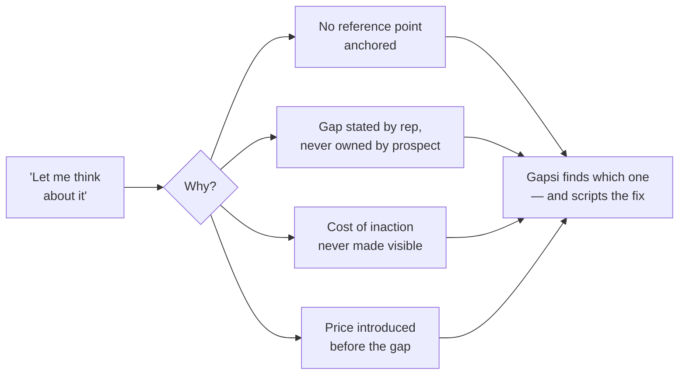
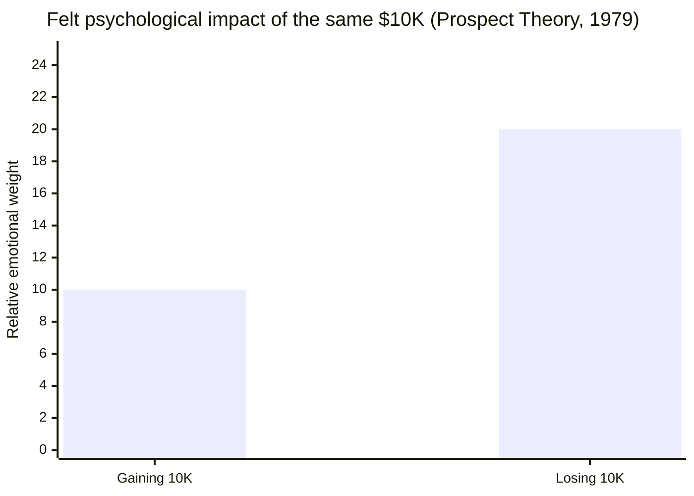
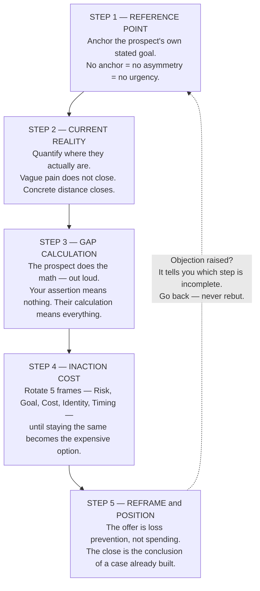
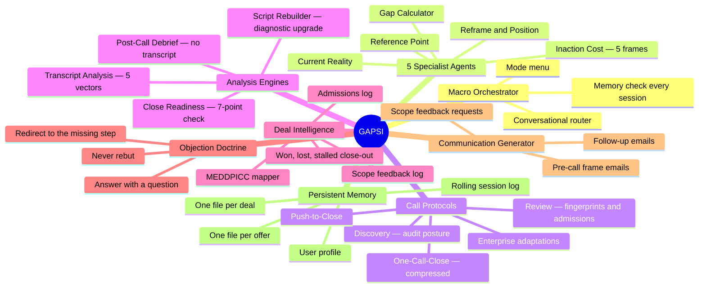
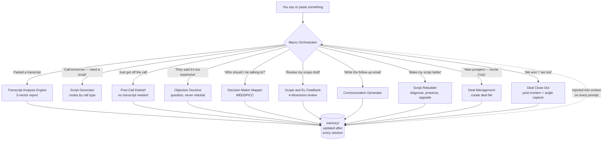
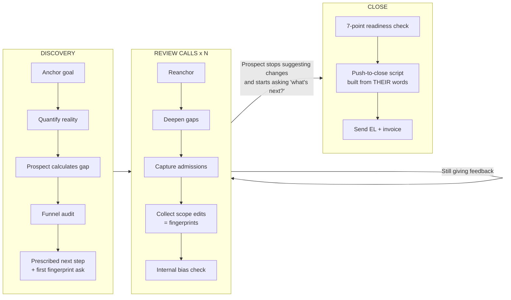
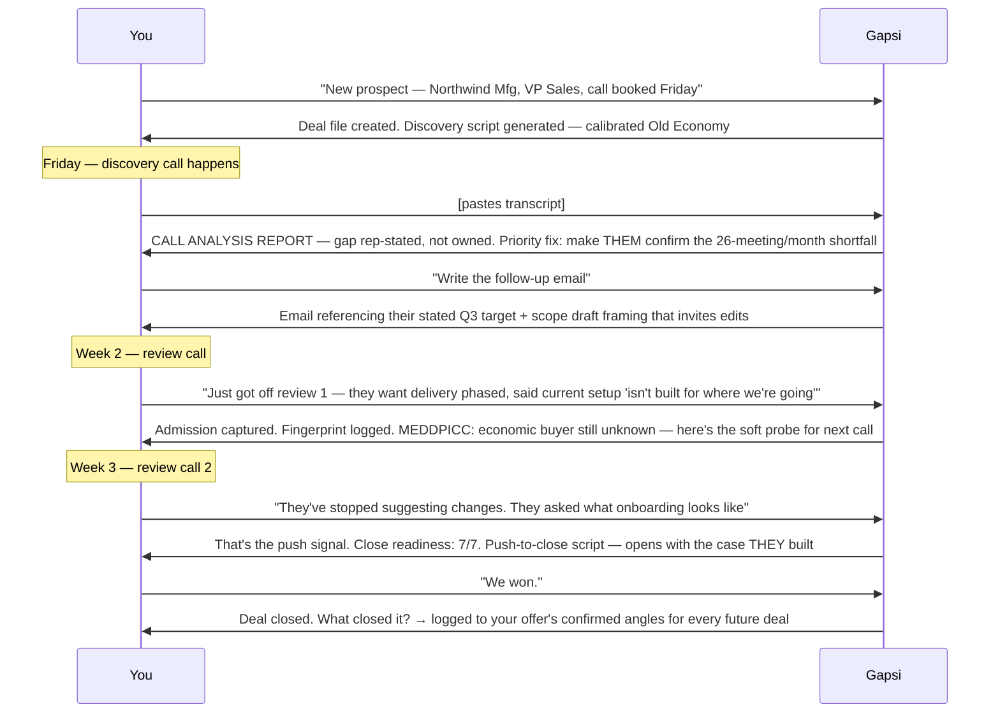
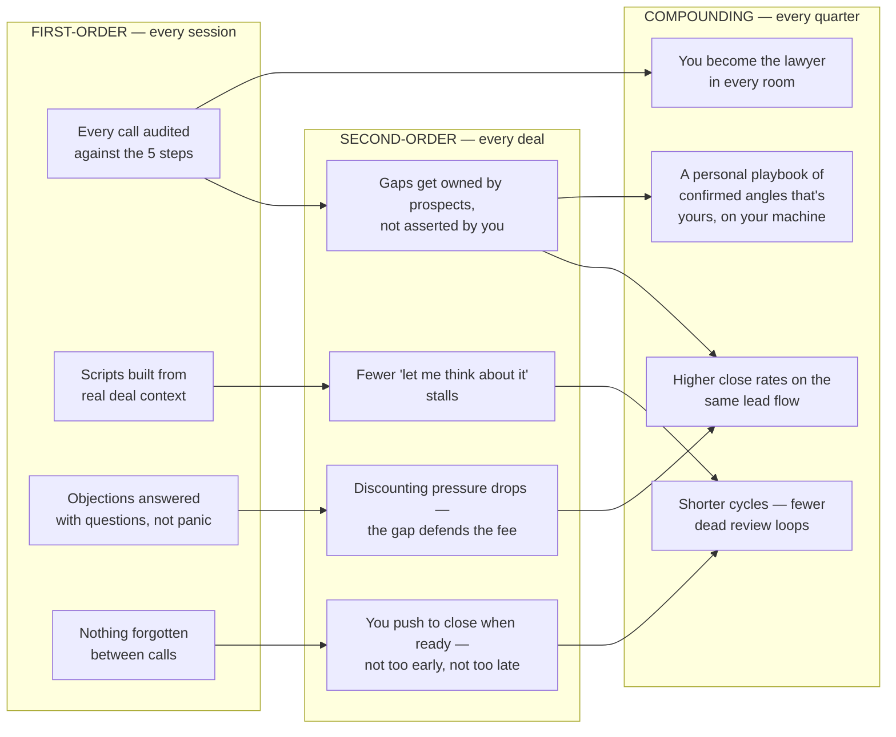
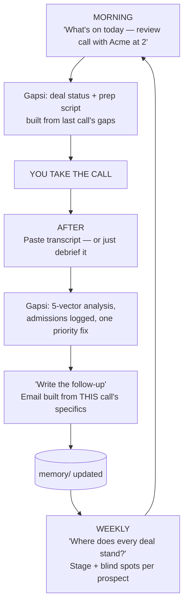

# Gapsi — B2B Sales Intelligence Agent


[](LICENSE)
[](https://claude.ai/code)
[](https://github.com/termsheetinator)

**A persistent B2B sales coach that lives inside Claude Code.** Paste a call transcript, get a forensic analysis of every gap you missed. Ask for a script, get one built from your offer, your deal history, and the prospect's own words. It remembers everything — every offer, every deal, every admission — across every session.

```bash
curl -fsSL https://raw.githubusercontent.com/termsheetinator/gapsi-agent/main/install.sh | bash
```

One install. One 3-minute onboarding. Then it coaches you for as long as you sell.

---

## Table of Contents

- [What This Is](#what-this-is)
- [The Problem It Solves](#the-problem-it-solves)
- [The Science It Runs On](#the-science-it-runs-on)
- [The Framework — 5 Steps](#the-framework--5-steps)
- [The Full System — Mind Map](#the-full-system--mind-map)
- [What It Covers](#what-it-covers)
- [How It Works](#how-it-works)
- [The 9 Modes](#the-9-modes)
- [How a Deal Moves Through Gapsi](#how-a-deal-moves-through-gapsi)
- [Scenarios — When You'd Reach For It](#scenarios--when-youd-reach-for-it)
- [Worked Example — One Deal, Start to Close](#worked-example--one-deal-start-to-close)
- [Output Format](#output-format)
- [The Results You Get](#the-results-you-get)
- [Benefits — and the Benefits of the Benefits](#benefits--and-the-benefits-of-the-benefits)
- [Fitting It Into Your Daily Workflow](#fitting-it-into-your-daily-workflow)
- [How It Remembers](#how-it-remembers)
- [How It Coaches](#how-it-coaches)
- [Who It's For](#who-its-for)
- [Tips for Users](#tips-for-users)
- [Install](#install)
- [Update](#update)
- [Files](#files)
- [Requirements](#requirements)

---

## What This Is

Gapsi is a Claude Code skill that turns Claude into a specialized B2B sales coach built on the **Loss Aversion Gap Framework** — a closing methodology grounded in six peer-reviewed behavioral economics studies. You paste a real call transcript, and it gives you a structured analysis of every gap, missed loss aversion angle, stalled commitment, and unhandled objection — then builds the exact script you take into your next call. It tracks every prospect in a per-deal file with a full MEDDPICC decision-maker map. It remembers your offers, your sales process, and your patterns across every session. One install, zero reconfiguration.

It is not a generic AI assistant with a sales prompt. It is a closed-loop sales system: **analyze → diagnose → script → call → analyze again** — with memory connecting every loop.

---

## The Problem It Solves

Most B2B deals don't die because the offer was wrong or the price was too high. They die because the case was never built:

- The rep never anchored the prospect's **goal** — so there was no reference point
- The current state was never **quantified** — so the pain stayed vague
- The rep stated the gap instead of letting the **prospect calculate it** — so it was never owned
- The cost of **doing nothing** was never made visible — so "let me think about it" felt safe
- Price showed up **before** the gap was expensive — so the fee floated alone, with nothing to compare against

Every one of those is detectable in a transcript. Every one of those is fixable on the next call. That's the entire job of this tool: find which step of the case collapsed, and hand you the exact language to rebuild it.



---

## The Science It Runs On

Gapsi's methodology isn't sales folklore. Every move is grounded in published, peer-reviewed research — with the actual numbers embedded in the coaching:

| Study | Finding | How Gapsi Uses It |
|---|---|---|
| **Kahneman & Tversky, 1979** — Prospect Theory | Losses feel **~2x** as painful as equivalent gains feel good | The entire framework: frame the engagement as stopping a loss, not buying an upside |
| **Tversky & Kahneman, 1981** — Framing Effects | Same decision, loss-framed vs. gain-framed: majority choice **reverses** (72% → 78% flip) | Loss framing doesn't nudge decisions — it reverses them. Gapsi checks every call for it |
| **Samuelson & Zeckhauser** — Status Quo Bias | Familiar pain beats unfamiliar improvement, even when the math favors change | Why "do nothing" is your real competitor — and how to make it expensive |
| **Kahneman, Knetsch & Thaler, 1990** — Endowment Effect | People value what they own at **~2.5x** its market worth | The prospect's current system carries inflated value in their mind. Surface what they've accepted as "normal" |
| **Heath, Larrick & Wu, 1999** — Goals as Reference Points | Falling short of a stated goal triggers **loss-aversion responses** — same machinery as losing money | Get the goal stated out loud, and the gap becomes an active, ongoing loss |
| **Novemsky & Kahneman, 2005** — Boundaries of Loss Aversion | Spending doesn't feel like a loss when the value exchange is clear | Price resistance is a gap problem, not a pricing problem |

The asymmetry the whole system is built on:



A confirmed $200K gap doesn't feel equal to a $50K fee — it feels roughly **4x heavier**. The fee is never the question. The gap is.

---

## The Framework — 5 Steps

> **People do not buy because the future is better. They buy when staying the same is more expensive than changing.**

Five steps. Each one has a dedicated specialist agent inside Gapsi that knows its science, its questions, its failure modes, and its fixes:



**The best closers are lawyers, not hype men.** They build a case so airtight the decision becomes obvious. Gapsi audits every call against these five steps and tells you exactly which part of the case collapsed.

---

## The Full System — Mind Map

Everything below ships in one skill file. No add-ons, no separate installs:



---

## What It Covers

```
━━━━━━━━━━━━━━━━━━━━━━━━━━━━━━━━━━━━━━━━━━━━━━━━━━━━━━━━━━━━━━
TRANSCRIPT ANALYSIS          5 analysis vectors per call
━━━━━━━━━━━━━━━━━━━━━━━━━━━━━━━━━━━━━━━━━━━━━━━━━━━━━━━━━━━━━━
Reference Point               Was the prospect's goal anchored?
Current Reality               Was their actual state quantified?
Gap Calculation               Did the prospect do the math — or the rep?
Inaction Cost                 Which of the 5 frames were missed?
Positioning                   Loss prevention or premature pitch?
━━━━━━━━━━━━━━━━━━━━━━━━━━━━━━━━━━━━━━━━━━━━━━━━━━━━━━━━━━━━━━
SCRIPT GENERATION            Adapts to call type + offer
━━━━━━━━━━━━━━━━━━━━━━━━━━━━━━━━━━━━━━━━━━━━━━━━━━━━━━━━━━━━━━
Discovery calls               Full audit-posture script + funnel audit
One-call-close                Compressed 5-step + hesitation handlers
Review calls                  Gap deepening, admissions, scope feedback
Closing calls                 Push-to-close built from their own math
Script rebuilds               Diagnostic + surgical upgrade of your script
━━━━━━━━━━━━━━━━━━━━━━━━━━━━━━━━━━━━━━━━━━━━━━━━━━━━━━━━━━━━━━
DEAL INTELLIGENCE            Per-prospect tracking
━━━━━━━━━━━━━━━━━━━━━━━━━━━━━━━━━━━━━━━━━━━━━━━━━━━━━━━━━━━━━━
MEDDPICC mapping              Full decision-maker map per deal
Admissions log                Their exact words, captured per call
Close readiness               7-point checklist before any push
Objection doctrine            Every objection answered with a question
━━━━━━━━━━━━━━━━━━━━━━━━━━━━━━━━━━━━━━━━━━━━━━━━━━━━━━━━━━━━━━
PERSISTENT MEMORY            Remembers across every session
━━━━━━━━━━━━━━━━━━━━━━━━━━━━━━━━━━━━━━━━━━━━━━━━━━━━━━━━━━━━━━
Multiple offers               One file per offer — price, deliverables, ICP
Deal files                    One file per prospect — gaps, admissions, stage
Objection library             Builds from real calls over time
Confirmed angles              Tracks what actually works for your offer
Session log                   Rolling history of last 5 sessions
━━━━━━━━━━━━━━━━━━━━━━━━━━━━━━━━━━━━━━━━━━━━━━━━━━━━━━━━━━━━━━
```

---

## How It Works

1. **Install once** — run the curl command in your project directory
2. **Onboard once** — `/gapsi-agent` walks you through your offers and sales process (3 min)
3. **Work your deals** — paste transcripts, debrief calls, ask for scripts, handle objections
4. **It routes you** — a macro orchestrator reads what you need and drops you into the right mode
5. **It remembers** — every gap, admission, and decision-maker detail persists in `memory/`

Every message you send hits the orchestrator first:



You never pick a mode. You just talk. The routing is the product.

---

## The 9 Modes

| # | Mode | What you get |
|---|---|---|
| 1 | **Analyze a call transcript** | 5-vector CALL ANALYSIS REPORT — what landed, what collapsed, one priority fix |
| 2 | **Prep for an upcoming call** | A full stage-by-stage script with exact language and the intent behind every question |
| 3 | **Work a deal** | Per-prospect tracking — stage, gaps, admissions, MEDDPICC, materials sent |
| 4 | **Debrief a call (no transcript)** | Same intelligence extraction, from your account of the call |
| 5 | **Map decision makers** | MEDDPICC map with blind spots flagged and the priority component to uncover next |
| 6 | **Get feedback on a scope/proposal** | 4-dimension review: gap alignment, language, outcome clarity, fingerprint readiness |
| 7 | **Draft an email** | Follow-up, pre-call frame, or scope-feedback request — built from the deal's actual gaps |
| 8 | **Add or update an offer** | Offer file with price, deliverables, ICP, objection library, confirmed angles |
| 9 | **Rebuild an existing script** | Diagnostic against all 5 steps, then surgical insertions — your voice preserved |

---

## How a Deal Moves Through Gapsi

Gapsi supports four sales process types — one-call-close, two-call-close, process-selling, and enterprise-cycle — and adapts every protocol to yours. Here's the full process-selling arc:



Two doctrines govern the whole arc:

**The Fingerprint Principle** — every edit the prospect suggests, every concern they raise, every section they comment on is them putting their hands on the deal. People advocate for what they helped build. The scope with their fingerprints on it is the scope they can defend internally.

**The Objection Doctrine** — never rebut. Every objection is diagnostic data telling you which of the 5 steps is incomplete:

| What they say | What it actually means | Gapsi's move |
|---|---|---|
| "It's too expensive" | Fear of execution, not affordability | "Compared to what — the current cost of the gap?" |
| "We need to think about it" | Something in the case isn't owned yet | "What part of what we've covered is still unclear?" |
| "We tried something like this before" | Past failure anxiety | "What happened relative to what you expected?" |
| "Now's not the right time" | Inaction cost not real enough | "What would need to change?" |
| "We're looking at other options" | Internal uncertainty | "What are those options solving that this doesn't?" |
| Silence after interest | Approval confusion | Don't chase. One value-add, then one micro-step CTA |

---

## Scenarios — When You'd Reach For It

**The morning before a discovery call.** You type "discovery call with Meridian Logistics tomorrow, COO, came in through a referral." Gapsi builds a full script: audit-posture opening, goal-anchoring questions, funnel audit sequence, decision-process probes, and a prescriptive close — calibrated to whether you're selling into Old Economy (credibility, stability, peer posture) or New Economy (mechanism, rigor, specificity).

**Ten minutes after a call ends.** You paste the transcript — nothing else. Gapsi already knows which deal it is, runs all five specialist agents against it, and hands you the report: reference point weak, gap rep-stated, inaction cost invisible, one priority fix. Then it offers the next-call script that repairs exactly those misses.

**No transcript? Same thing.** "Just got off with Acme — they liked the scope but the CFO wasn't on the call." Gapsi debriefs you, captures the admission, flags that your MEDDPICC economic-buyer component is still unconfirmed, and updates the deal file.

**Mid-deal, mid-panic.** "They just emailed saying the price feels high. What do I say?" Gapsi pulls the deal file — they confirmed a $200K gap in review call 2 — and gives you the question that routes them back to their own math instead of a discount.

**Your old script, upgraded.** You paste the one-call-close script you've used for two years. Gapsi asks what's working and where prospects stall, diagnoses it against all 5 steps, and proposes surgical insertions — your language preserved, one gap at a time, with your confirmation at each step.

**The push.** "Is Northwind ready to close?" Gapsi runs the 7-point readiness checklist — gap owned, admissions captured, fingerprints on scope, champion can articulate the case, economic buyer path known — and either generates the push-to-close script or tells you the one thing still missing.

---

## Worked Example — One Deal, Start to Close



Every step of that exchange used memory from the steps before it. By the close, the script wasn't generic — it was built from that prospect's stated goal, their math, their admissions, and their fingerprints.

---

## Output Format

**After transcript analysis:**
```
╔══════════════════════════════════════════════════════════════╗
║  CALL ANALYSIS REPORT                                        ║
║  Acme Industrial  ·  Discovery  ·  June 3                    ║
╠══════════════════════════════════════════════════════════════╣
║                                                              ║
║  REFERENCE POINT               [~ Weak]                      ║
║  Prospect said "we want to grow outbound" — never anchored   ║
║  to a number. No target = no gap = no urgency.               ║
║                                                              ║
║  CURRENT REALITY               [✓]                           ║
║  14 qualified meetings/month, 2 SDRs, no consistent channel. ║
║                                                              ║
║  GAP CALCULATION               [~ Rep-stated]                ║
║  Target: 40/mo  ·  Current: 14/mo  ·  Gap: 26/mo            ║
║  Rep asserted the math — prospect never confirmed it.        ║
║                                                              ║
║  INACTION COST                 [✗ Invisible]                 ║
║  Frames used:   none                                         ║
║  Frames missed: Cost, Timing, Goal                           ║
║                                                              ║
║  POSITIONING                   [✗ Premature]                 ║
║  Price introduced before the gap was confirmed or costed.    ║
║                                                              ║
║  ADMISSIONS CAPTURED                                         ║
║  · "We've known outbound was broken since Q4."               ║
║                                                              ║
╠══════════════════════════════════════════════════════════════╣
║                                                              ║
║  FLAGS                                                       ║
║  GAP NOT OWNED · INACTION INVISIBLE · PREMATURE CLOSE        ║
║                                                              ║
║  PRIORITY FIX                                                ║
║  Open the next call by making the prospect confirm the       ║
║  26-meeting gap out loud — nothing else lands until the      ║
║  math is theirs.                                             ║
║                                                              ║
╚══════════════════════════════════════════════════════════════╝
```

**When you ask for a script**, you get the same treatment — stage-by-stage, exact language in quotes, and the intent behind every question in brackets:

```
╔══════════════════════════════════════════════════════╗
║  REVIEW CALL SCRIPT                                  ║
║  Acme Industrial  ·  Review Call 2                   ║
╠══════════════════════════════════════════════════════╣
║                                                      ║
║  OPENING — REANCHOR                                  ║
║  "Last time, you said the target was 40 qualified    ║
║  meetings a month and you're at 14. Before we go     ║
║  further — has anything changed?"                    ║
║  [Reanchors their reference point without            ║
║  starting over]                                      ║
║                                                      ║
║  PHASE 1 — DEEPEN EXISTING GAPS                      ║
║  "We didn't fully dig into what that 26-meeting      ║
║  shortfall costs. What does that look like in        ║
║  pipeline terms?"                                    ║
║  [Their math, their words — not yours]               ║
║  ...                                                 ║
╚══════════════════════════════════════════════════════╝
```

---

## The Results You Get

**After every call:**
- A verdict on each of the 5 steps — established, weak, or missing — with the exact quote that proves it
- Every objection that came up, what you said, and the sharper question you should have asked
- **One** priority fix. Never a list of twelve. The single change with the most leverage

**Across every deal:**
- A MEDDPICC map that tells you who actually signs, who champions, and which blind spot to close next
- An admissions log — the prospect's own words acknowledging the cost of staying the same — that becomes the raw material of your closing script
- A close-readiness verdict before you push, so you never send an engagement letter into a case that isn't built

**Over months:**
- An objection library that grows from *your* real calls, mapped to responses that worked
- A confirmed-angles file per offer — which loss-aversion frames actually close *your* buyers
- A coach that knows your habits: the step you chronically skip, the moment you tend to pitch too early

---

## Benefits — and the Benefits of the Benefits

First-order benefits are what the tool does. Second-order benefits are what that does to your pipeline. Compounding benefits are what that does to your business:



The deepest benefit isn't any single script. It's that the methodology gets **installed in you**. After thirty analyzed calls, you start hearing the missing reference point in real time, mid-conversation — before Gapsi ever sees the transcript.

---

## Fitting It Into Your Daily Workflow

Gapsi is built around the rhythm of a selling week, not a chat window:



Typical touchpoints:

| Moment | What you do | Time |
|---|---|---|
| Before any call | "Prep me for [prospect]" | 2 min read |
| After any call | Paste transcript or debrief | 3 min |
| Stuck on a reply | "They said X — what do I say?" | 30 sec |
| Before sending a scope | "Review this draft" | 2 min |
| Before pushing to close | "Is [prospect] ready?" | 1 min |
| Deal ends | "We won/lost — here's why" | 1 min, compounds forever |

No dashboards to maintain, no CRM fields to fill. The memory updates itself as a side effect of you working your deals.

---

## How It Remembers

Gapsi stores everything in a `memory/` folder in your project directory — plain markdown files you can read, edit, or delete. No external database, no API keys, no cloud sync. Everything lives on your machine.

```
memory/
├── MEMORY.md              ← index of everything in memory
├── user-profile.md        ← your sales process, style notes, what works
├── offer-[slug].md        ← one file per offer you sell
├── session-log.md         ← rolling log of last 5 sessions
└── deals/
    └── deal-[slug].md     ← one file per prospect — MEDDPICC, gaps, admissions
```

A hook reads these files on every prompt and injects them into Claude's context automatically — your profile, offers, and session log in full, plus a summary of every active deal. You never have to re-explain your offers, and Gapsi never asks you a question your memory already answers.

**Privacy is structural, not promised:** if your project is a git repository, the installer adds `memory/` to your `.gitignore` automatically, so prospect names, pricing, and admissions can never be committed or pushed.

---

## How It Coaches

The coaching philosophy is opinionated, and it shows in every output:

- **One PRIORITY FIX per analysis** — never a list of twelve. Leverage, not volume.
- **Exact language, always** — never "build more urgency." Always the actual sentence to say, in quotes, with the intent in brackets.
- **The prospect's words over your words** — every script is rebuilt from what *they* said, because their calculation closes and your assertion doesn't.
- **No filler** — no "great question!", no pep talks, no summary paragraphs of things you already know. A sharp advisor who's been in these deals before.
- **It preserves what works** — the Script Rebuilder never replaces your field-tested language. It diagnoses, then inserts surgically, one confirmed change at a time.
- **It will not do your paperwork** — Gapsi gives feedback on your scopes and engagement letters but never writes them. The thinking stays yours; the deal stays yours.

---

## Who It's For

**Built for:** B2B operators selling high-ticket services and solutions — $15K to $250K+ engagements. Founders who sell, fractional executives, agency owners, advisory firms, consultants, and AE/sales teams running discovery → proposal → close motions. Works whether you close in one call or across an enterprise cycle.

**Not for:** transactional e-commerce, PLG self-serve funnels, or anyone looking for a tool that sends emails or dials prospects *for* them. Gapsi makes **you** better in the room. It doesn't replace the room.

---

## Tips for Users

- **Trigger:** Type `/gapsi-agent` in Claude Code — first run starts onboarding, subsequent runs load your memory
- **Transcripts:** Paste the raw transcript directly into the chat — no preamble needed; Gapsi will figure out the deal and call type
- **No transcript? Debrief anyway.** Even a two-sentence account of a call keeps the deal file alive
- **Multiple offers:** Add new offers anytime — just tell Gapsi you want to add one
- **After a win or loss:** Tell Gapsi why. That one minute compounds into your confirmed-angles playbook
- **What works:** When an angle or script closes a deal, say so — it gets tracked in your offer file and reused

---

## Install

Run this command in the directory where you work with Claude Code:

```bash
curl -fsSL https://raw.githubusercontent.com/termsheetinator/gapsi-agent/main/install.sh | bash
```

Then open Claude Code in that directory and type `/gapsi-agent`.

---

## Update

Re-run the same install command — it overwrites the skill and hook with the latest version:

```bash
curl -fsSL https://raw.githubusercontent.com/termsheetinator/gapsi-agent/main/install.sh | bash
```

Your `memory/` files are never touched by the installer, and an existing `.claude/settings.json` is merged into — not overwritten.

---

## Files

| File | What It Does |
|---|---|
| `gapsi-agent.md` | Main skill file — installs to `~/.claude/skills/gapsi-agent/SKILL.md` |
| `install.sh` | One-command installer — downloads skill, hook, creates memory dir |
| `.claude/hooks/gapsi-active.sh` | UserPromptSubmit hook — injects memory into every session |
| `.claude/settings.json` | Hook wiring — written or merged by the installer |
| `memory/MEMORY.md` | Memory index — created at install, populated during onboarding |
| `memory/user-profile.md` | Your sales process and what works — created during onboarding |
| `memory/offer-[slug].md` | One file per offer — created during onboarding or when you add an offer |
| `memory/session-log.md` | Rolling log of last 5 sessions — updated after every session |
| `memory/deals/deal-[slug].md` | One file per prospect — MEDDPICC map, gaps, admissions, feedback log |

---

## Requirements

- [Claude Code](https://claude.ai/code) (CLI or desktop app)
- Anthropic account

---

*Gapsi is built on peer-reviewed behavioral science: Kahneman & Tversky (Prospect Theory, 1979), Tversky & Kahneman (Framing Effects, 1981), Samuelson & Zeckhauser (Status Quo Bias), Kahneman, Knetsch & Thaler (Endowment Effect, 1990), Heath, Larrick & Wu (Goals as Reference Points, 1999), Novemsky & Kahneman (Boundaries of Loss Aversion, 2005).*

*Built by [termsheetinator](https://github.com/termsheetinator) · Part of the InfraSuite · Advisory Incubator™*
